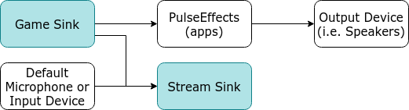

# README

This repository contains scripts for people using PulseAudio along with PulseEffects (i.e. for speaker equalization) or PipeWire with EasyEffects who wish to stream gameplay and sound using software like OBS or Discord.

## game-audio-setup

This script creates two sinks:
- Game Sink (intended to capture game audio only)
- Stream Sink (intended to capture game audio & microphone input)

Aditionally, it creates the necessary loopbacks to achieve the following setup:

When starting a game or application its audio stream is captured by PulseEffects by default which bypasses this entire setup, so it is necessary to open `pavucontrol` and in the Playback tab change the game's output from PulseEffects(apps) to **Game Sink** which then outputs to both PulseEffects(apps) and **Stream Sink**.

(Note: When running the script, it loopbacks the current default input device to Stream Sink. Make sure to select the correct input device as default before running the script.)

### Streaming

If using OBS you can add an audio source pointing to either **Game Sink** or **Stream Sink** depending on whether you want to stream your microphone or not.  
Another possibility is to add two separate audio sources; **Game Sink** and your microphone, if you want to be able to mute only your microphone but not the game audio mid-stream.

If using Discord you should go to Voice & Video settings and set the input device to **Monitor of Stream Sink**.  
If it is not in the list of input devices, you will have to join a Discord voice channel and then change the input device from `pavucontrol` by going to the Recording tab and changing the recstream of **WEBRTC VoiceEngine** to **Monitor of Stream Sink**.  
You can also use **Monitor of Game Sink** but keep in mind that the latter doesn't capture your microphone and your friends in Discord won't be able to hear you speak, only the game's audio.  
Other recommendations for Discord include:
- Setting the input mode to voice activity and manually setting the voice activity threshold to its minimum value.
- Disabling Echo Cancellation and Noise Reduction in the Voice Processing section of the Voice & Video settings.

## game-audio-teardown

The `game-audio-setup` script also saves a file with the id's of the loaded PulseAudio modules (sinks and loopbacks) in `/tmp/`

Once you are done using the Game and Stream sinks you can run `game-audio-teardown` to unload these modules and get PulseAudio back to how it was originally.
